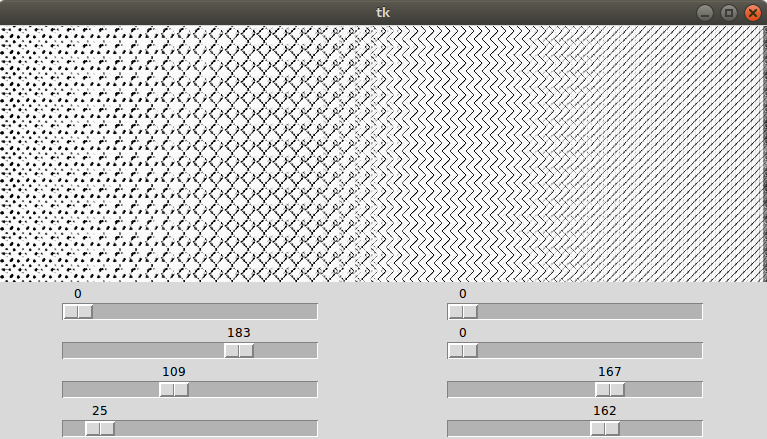
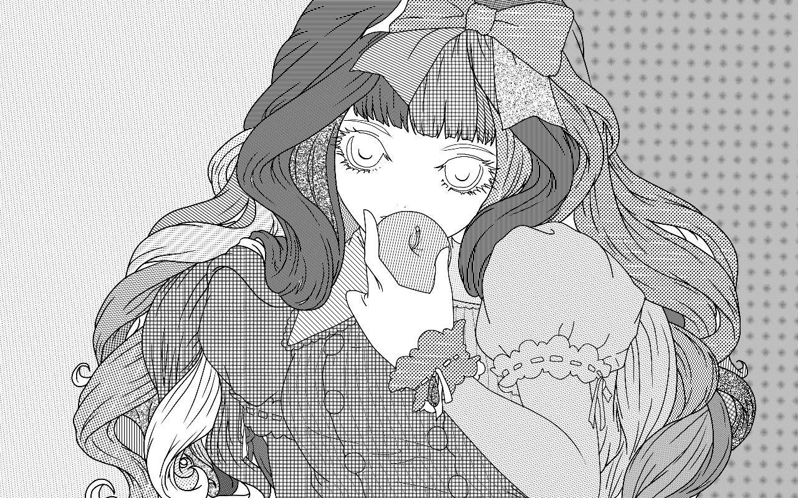
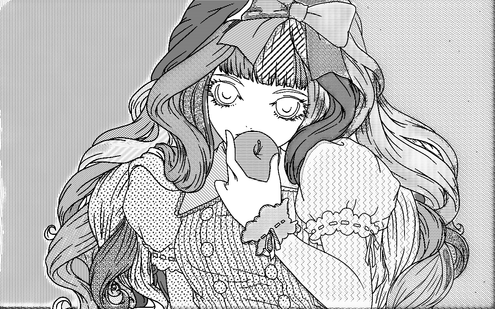

# ScreenVAE

Pytorch implementation for screentone encoding. 
For example, given the manga image with screentone, our model is able to generate feature representations which is plain within the region with same screentone and can also reconstruct the original manga image. 

**Note**: The current software works well with PyTorch 1.1+. 

## Example results


## Prerequisites
- Linux or Windows
- Python 3
- CPU or NVIDIA GPU + CUDA CuDNN


## Getting Started ###
### Installation
- Clone this repo:
```bash
git clone https://github.com/msxie92/ScreenStyle.git
cd ScreenStyle/screenVAE
```
- Install PyTorch and dependencies from http://pytorch.org

### Visulization
- Generate screentones by sampling in the intermediate domain:
```
python visual.py 
```

Examples:



### Screentone Editing
- Edit screentones by modifying the value in the intermediate domain:
```
python edit.py 
```

Examples:




## Models
Download the pre-trained models from [Google Drive](https://drive.google.com/file/d/1OBxWHjijMwi9gfTOfDiFiHRZA_CXNSWr/view?usp=sharing) and place under checkpoints/ScreenVAE.

## APIs
Check api.py for detail.  
Here is an example.  
```python
# Manually include path to this project (the 'ScreenStyle' folder) in sys.path
import sys
sys.path.append('/path/to/this/project')

# import API
from ScreenVAE import SVAE

# Initialize an API object.
# You can choose to load other directories under checkpoints/ by passing their name as argument.
# It is recommended to freeze the seed for ramdom number to 0 to replicate the performance in paper.
rec = SVAE(freeze_seed=0)
# Get screenmap with img2map method.
# You may use path (to an image) or numpy array here.
scr = rec.img2map('examples/manga.png', 'examples/line.png')
# Convert screenmap to visual image with get_pca method.
# Note that this image is only for visualization!
PCAimg = rec.get_pca(scr)
# Convert screenmap back to screentone with map2img method.
# You may use path (to a saved .npy file) or numpy array here.
retone = rec.map2img(scr)
# You may make use of lines like this:
retone = rec.apply_line(retone, line)
```
Your can process multiple images **with the same shape** in one shot.  
But for batch functions you can only provide list of numpy arrays or a numpy array that is concatenated from image arrays.  
DO NOT TRY TO RESIZE IMAGES TO FIT THEM TO THE SAME SIZE because it will destroy screentones, but feel free to resize screenmaps because they are interpolative.  
```python
from PIL import Image
import numpy as np
from ScreenVAE import SVAE

rec = SVAE(freeze_seed=0)
img_paths = ['/path/to/your/image1', '/path/to/your/image2', ...]
imgs = [np.asarray(Image.open(p)) for p in img_paths]
line_paths = ['/path/to/your/line1', '/path/to/your/line2', ...]
lines = [np.asarray(Image.open(p)) for p in line_paths]
scrs = rec.img2map_batch(imgs, lines)
```

## Training
I've implemented the 4 loss functions mentioned in the paper. However, there are something unclear:  
- Adversarial Loss  
  - The discriminator used in adversarial_loss is `learnable`, but @msxie92 didn't provide a checkpoint.  
  - Also, the detail of the discriminator itself is unclear. (What is "4 strided downscaling blocks"?).  
- Superpixel Loss
  - They used L0-Smoothing and SLIC, but the params of these 2 algorithms remain unknown.
  - They used SPN, but which? (likely to be https://github.com/idealwei/SuperPixelPool.pytorch) And how did they use it??? It seems that they only borrow its loss function.
  - They say:
    > Then we remove the varying-toned regions from `Ispp` by estimating regional texture feature variances. In particular, if two regions are of the same tone but with different textures, we separate the regions into two superpixels in the superpixel map `Ispp`.  
    
    But how did they do that???  
    (According to the code, they may have used gaborwavelet for texture analysis)  

My implementation:  
- Adversarial Loss  
  - I eventually copied the discriminator from the style extractor Est (which have "5 strided downscaling blocks").  
    - It is like the implementation of wgan-gp.  
- Superpixel Loss  
  - I decide to make the obtainment of superpixel map `Ispp` a step of preprocessing, just like the usage of line extraction. (`Ispp` only depends on original manga image `Im`)  